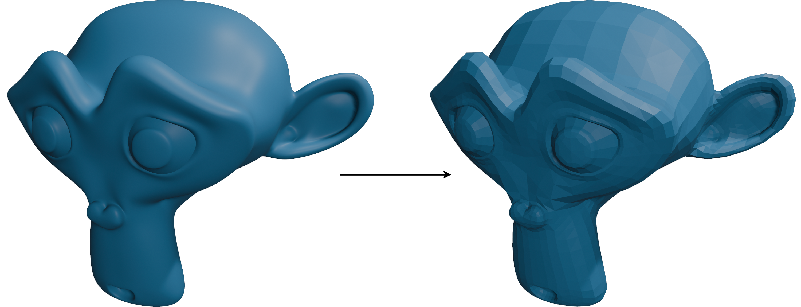
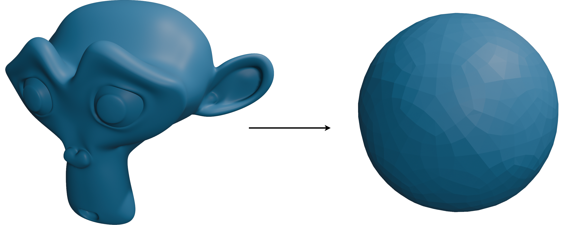
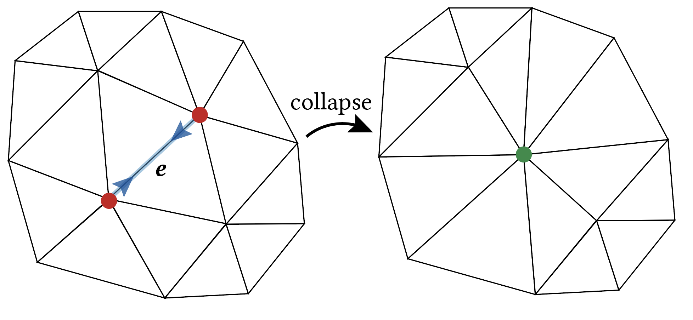
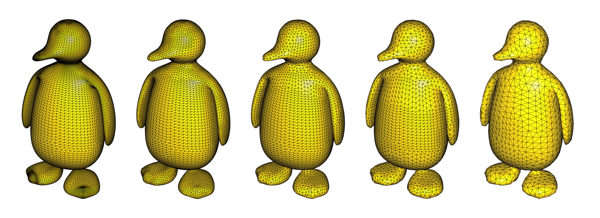
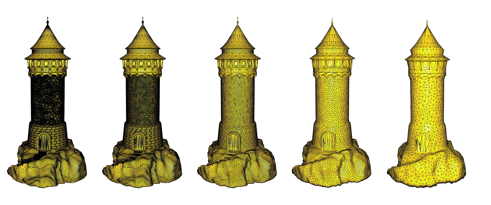
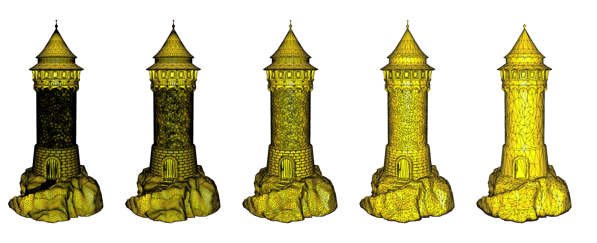

# Geometry Processing Decimation

> **To get started:** Clone (**do not fork publicly**) this repository
> 
>     git clone --recursive https://github.com/odedstein/fs-2024-csci-599-exercise-6.git
>

## Installation, Layout, and Compilation

See
[introduction](https://github.com/odedstein/fs-2024-csci-599-exercise-1).

## Execution

Once built, you can execute the assignment from inside the `build/` by running
on a given mesh.

    ./decimate [path to mesh.obj]

## Background

A common task in geometry processing is _mesh decimation_.
Sometimes we have a surface with too many vertices.
Maybe there are so many vertices that the memory consumption is too much for the
device we want to store our geometry on.
Maybe we want to run a geometry processing method or physical simulation method
that scales very badly in the number of vertices (like $O(n^4)$ ), so the
operation would take prohibitively long on a very fine mesh.
What we need is the same mesh, but with fewer vertices
(see [subdivision](https://github.com/odedstein/fs-2024-csci-599-exercise-5) for how a low-resolution function can be upsampled onto a high-resolution mesh).

### What do we want?

Just removing faces and vertices is not enough to make a good decimation method.
There are a few important _desiderata_ that our decimation method should
fulfill in order to serve its purpose:

#### The geometry of the decimated mesh should be as close as possible to the original one.
One obvious desideratum is that our decimated mesh should look as close as
possible to the original mesh with the lower number of degrees of freedom that
are now available to us.
So, for example, this is an acceptable decimation result:

while this is a bad decimation result:

Even though both decimated meshes have a similar number of triangular faces,
the first one is recognizably still a monkey, and the second one is not - we say
that the _geometry_ of the mesh has been preserved better.

#### The algorithm should not destroy the topology of the mesh.
If our input mesh has a nice topology, such as no non-manifold edges and no
non-manifold vertices, then a decimation method should not destroy this
property.
If a mesh did not have a boundary or holes before, it should not have any new
boundaries or holes after the method is run.
We say that the _topology_ of the mesh should be preserved as much as possible.

#### The method should run in reasonable time.
We do not want the decimation method to take forever.
As a result, we probably do not want to solve a global optimization problem to
remove a single triangle.

We will now look at one possible way to create a decimation method that
fulfills our requirements.

## Greedy edge collapse

Let $E$ be the set of edges of our mesh.
Assume we have some cost function

$$
\sigma : E \rightarrow \mathbb{R}
$$

that tells us which edge is _cheapest_ to collapse.
The basic framework we will use for mesh decimation in this exercise is
_greedy edge collapse_.
We simply collapse the cheapest edge until we have reached our target face
count.

How does one collapse an edge?
Every edge has two vertices (indicated in red below, the _old vertices_),
and two (or one, if at the boundary) adjacent faces.
An edge collapse operation removes the adjacent faces, and replaces the two
red vertices with a _new vertex_ (indicated in green below) whose position has
to be specified separately:

This is very simple conceptually, but slightly tricky in implementation.
When implementing this, make sure to not accidentally introduce infinitesimal
holes in your mesh - you will need to remove the indices of the two old red
vertices from the index list wherever they appear, and replace them with the
index for your new green vertex.

Our greedy mesh decimation algorithm now follows the following simple
pseudocode:
1. Find the lowest-cost edge $e \in E$.
2. Collapse $e$: remove the two triangles associated with $e$.
3. Move the new vertex created by the collapse of $e$ to its target position.
4. Repeat until we have decimated the mesh enough.

The difficulty is now entirely contained in the definition of the cost function 
$c$ and a strategy for positioning the new vertex.
How can we find an edge collapse cost function that fulfills our desiderata:
collapsing edges in a way that will preserve geometry best, not change the
topology wildly, and be relatively easy to compute?

## Shortest edge collapse

A naive approach to finding the next edge to collapse is given by the
_shortest edge_ cost function.
The name already tells you everything you need to know about this.
If the edge $e$ has vertices $v_1$, $v_2$, then the cost function is

$$
\sigma(e) = \lVert v_1 - v_2 \rVert \; ,
$$

and the position of the new green vertex $v^*$ is

$$
v^* = \frac{1}{2} \left( v_1 + v_2 \right) \; .
$$

This cost function means that the greedy decimation function will always
collapse the currently shortest edge in the mesh, and will place the green
vertex exactly in the middle of where the old edge used to be.

Even though this decimation method is very naive, it works really well in
practice.
Here it is applied to the mesh of a penguin:

Shortest edge collapse, in general, works well on meshes that have lots of
similarly-sized triangles and no rough contours.
As soon as this is no longer the case, weaknesses start to show - short edges
can represent geometrically important features in such meshes, and shortest
edge collapse removes these no matter how important they are:

## Quadric error minimization

We can do better than just collapsing the shortest edge - we can look at
higher-order surface metrics that we want to preserve during decimation.
A very popular metric to use for this is the quadric error metric, introduced
to decimation by [Garland and Heckbert](https://www.cs.cmu.edu/~./garland/Papers/quadrics.pdf) (and [later extended](https://www.cs.cmu.edu/~garland/Papers/quadric2.pdf)).
The resulting method is called _qslim_.
This section introduces a simplified variant of qslim.

The idea of qslim is to associate a set of _planes_ with each vertex of the
mesh.
The error of the mesh at a vertex (i.e., the failure of this vertex to be in
its correct position) can be defined as a quadratic form that measures the
distance of the vertex, $v$, to all planes $p$ spanned by the triangles that
contain the vertex as one of its corners.
Except for degenerate cases, the set of all planes spanned by triangles with
$v$ as a corners intersect only at a single point: $v$.
The cost of removing a vertex will be this error of the new red vertex with
respect to the intersection point of all old planes.

This plane error is given by:

$$
\epsilon(\mathbf{v}) = \sum_{P \in \textrm{planes}(\mathbf{v})}
\left( \mathbf{v} - \textrm{proj}_P(\mathbf{v})  \right)^2
$$

Let's write this as a single matrix-vector equation.
Assume a plane is given by the vector $\mathbf{n}$ and the scalar $d$ in the
following way, where the plane consists of all $\mathbf{v}$ that zero

$$
\mathbf{n}^T \mathbf{v} + d = 0 \; .
$$

Then the squared distance between $\mathbf{v}$ and its orthogonal projection onto
the plane is given by

$$
(\mathbf{n}^T \mathbf{v} + d)^2 = \mathbf{v}^T (\mathbf{n}\mathbf{n}^T) \mathbf{v} + 2 d \mathbf{n}^T \mathbf{v} + d^2 \; .
$$

We can represent that squared distance with the _quadric_ $Q$, a tuple
consisting of a matrix, a vector and a scalar as such:

$$
 Q = \left( \mathbf{A}, \mathbf{b}, c \right) = \left( \mathbf{n}\mathbf{n}^T, d \mathbf{n}, d^2 \right)
 \; ,
$$

$$
 Q(\mathbf{v}) = \mathbf{v}^T \mathbf{A} \mathbf{v} + 2 \mathbf{b}^T \mathbf{v} + c
 \; .
$$

Why would we write a plane as a quadric?
If we now _add_ the quadrics for multiple planes together as a sum of tuples,
$Q = Q_1 + Q_2$, then the distance to both planes can be evaluated with the
same quadric evaluation formula as above,

$$
 Q(\mathbf{v}) = \mathbf{v}^T \mathbf{A} \mathbf{v} + 2 \mathbf{b}^T \mathbf{v} + c
 \; ,
$$

just with a different matrix $\mathbf{A}$, vector $\mathbf{b}$ and scalar $c$
that are a result of the earlier sum operation.

Our first task when performing the qslim method is thus to compute the quadric for
all adjacent planes at each vertex in the mesh by computing the quadrics for
all triangles that contain that vertex and adding them together.
When computing this sum, we should weigh each face quadric by the area of the
face, so that each triangle contributes according to its size.
The quadric at the vertex $\mathbf{v}$ is thus

$$
Q_{\mathbf{v}} = \sum_{\textrm{faces } f \textrm{ containing } \mathbf{v}}
\textrm{area}(f) Q_f
\; ,
$$

where $Q_f$ is the quadric of the triangle $f$.

The quadric of the edge $e$ is simply the sum of the quadrics of both of its
vertices $\mathbf{v}_1$, $\mathbf{v}_2$:

$$
Q_e = \mathbf{v}_1 + \mathbf{v}_2
\; .
$$

Computing these quadrics is expensive, and if you recompute them every time
you want to evaluate $c$, this might make your method very slow.
Fortunately, a lot of the work can be pre-computed - you only need to compute
each quadric once, then you can cache the results and recompute new quadrics
only when the local geometry changes.

Now that we have computed the quadrics we can easily evaluate the error
introduced by collapsing the edge $e$ with quadric
$Q_e = \left( \mathbf{A}, \mathbf{b}, c \right)$ and introducing the new green
vertex $\mathbf{\bar{v}}$.
The error is

$$
Q_e(\mathbf{\bar{v}}) = \mathbf{\bar{v}}^T \mathbf{A} \mathbf{\bar{v}} + 2 \mathbf{b}^T \mathbf{\bar{v}} + c
\; .
$$

We can minimize this error by differentiating $Q_e(\mathbf{\bar{v}})$ and
setting the gradient to zero.
The optimum is attained at

$$
\mathbf{\bar{v}} = - \mathbf{A}^{-1} \mathbf{b}
\; ,
$$

$$
Q(\mathbf{\bar{v}}) = - \mathbf{b}^T \mathbf{A}^{-1} \mathbf{b} + c
\; .
$$

This gives us the cost function $\sigma$ and new vertex position $v^*$ for the
qslim method:

$$
\sigma(e) = - \mathbf{b}_e^T \mathbf{A}_e^{-1} \mathbf{b}_e + c_e
\; ,
$$

$$
v^* = - \mathbf{A}_e^{-1} \mathbf{b}_e
\; .
$$

Inverting $\mathbf{A}$ is not always possible, especially in floating point
mathematics.
Detect such cases so your program does not crash, and think of a smart fallback
behavior to employ when you cannot invert!

### Boundaries

The algorithm as described above does not work correctly on meshes with
boundaries, and can produce catastrophic results.
To extend qslim to work with boundaries, boundary edges must be treated
differently.
Garland and Heckbert use the following ingenious approach:
For every boundary edge $e \in E$ there is a unique plane that contains $e$ and
is orthogonal to the single face $f$ that contains $e$.
This plane has a quadric just like every other plane described above.
We can add it to the initial quadrics of the end points of the edge, weighted
with an appropriate term
(try playing around with it - `libigl` uses the squared length of the boundary
edge `e` as a weight).
This will prevent premature collapse of boundary edges.

### Is it better?

Using the quadric error metrics, and making sure to always remove the edge
that will introduce the smallest plane error leads to a decimation routine that
preserves details better than simple shortest edge collapse, as can be seen in
the example of the tower mesh:

## Tasks

### Read the original

Read [Garland and Heckbert's original quadric error metric paper](https://www.cs.cmu.edu/~./garland/Papers/quadrics.pdf) and [their follow-up](https://www.cs.cmu.edu/~garland/Papers/quadric2.pdf).

### White list

  - `igl::edge_flaps`
  - `igl::remove_unreferenced`
  - `igl::decimate_callback_types`

### Black list

  - `igl::decimate`
  - `igl::qslim`
  - `igl::decimate_trivial_callbacks.h`
  - `igl::max_faces_stopping_condition.h`
  - `igl::shortest_edge_and_midpoint.h`
  - `igl::collapse_edge.h`
  - `igl::qslim_optimal_collapse_edge_callbacks.h`
  - `igl::per_vertex_point_to_plane_quadrics.h`

### `src/decimate.cpp`

This function implements an abstract decimation function that greedily
collapses edges until a stopping condition is reached.
The input to this function  is:
- a triangle mesh given as a vertex list / face list `(V,F)`;
- a function `decimate_cost_and_placement_callback` that, for each edge in the mesh, specifies how much it would cost to collapse it, and where the new vertex resulting from the edge collapse should be placed;
- a function `stopping_condition` that determines whether the decimation has reached its goal;
- a function `pre_collapse` that is called before a collapse is performed; and
- a function `post_collapse` that is called after a collapse is performed.

The output is:
- a decimated mesh `(U,G)`;
- a vector `J` that maps the indices of `G` into the corresponding index in `F` that the decimated face originated from; and
- a vector `I` that maps the indices of `U` into the corresponding index in `V` that the decimated face originated from.

Read the definitions in `igl/decimate_callback_types.h` to see exactly how
the callback functions should be specified.
These callback functions require edge flap data as computed by libigl as input.
Use `igl::edge_flaps` (in the white list) to compute edge flap data, and read
its documentation carefully.

Your algorithm should, as described in this document, look for the cheapest edge
to collapse, collapse it, insert a new vertex in place of the collapsed edge,
and deal with the required change to all triangles to account for the changed
topology.

Make liberal use of data structures to speed up computation, otherwise this
function will be very slow.
You can use, for example, a variety of C++ standard library functions to
implement a constant-time lookup priority queue which will speed up your search
for the next edge to collapse.
When you collapse an edge, do not recreate the entire vertex list / face list
anew - this will be very expensive (though you might want to have this as a
baseline to see whether your implementation is correct).
Find a way to mark certain vertices and faces as obsolete, leaving "junk" data
in your matrices during operation, and only clean up the data at the very end.

Be extremely careful to only return valid triangle meshes.
It is easy to leave "junk" data lying around in your vertex list or face list
because of operations during the collapsing phase that you did not properly
clean up.

### `src/shortest_edge_collapse.cpp`

Using your `decimate` function, implement a routine for decimation via shortest
edge collapse.
The input of this function is an existing vertex list / face list `(V,F)` and
a desired number of target faces.
The output is:
- a decimated mesh `(U,G)`;
- a vector `J` that maps the indices of `G` into the corresponding index in `F` that the decimated face originated from; and
- a vector `I` that maps the indices of `U` into the corresponding index in `V` that the decimated face originated from.

You can implement this function using your implementation of `decimate` by
specifying the right `cost_and_placement` and `stopping_condition` functions.

### `src/qslim.cpp`

Using your `decimate` function, implement a routine for decimating via quadric
error metrics, as described earlier in this document.
The input of this function is an existing vertex list / face list `(V,F)` and
a desired number of target faces.
The output is:
- a decimated mesh `(U,G)`;
- a vector `J` that maps the indices of `G` into the corresponding index in `F` that the decimated face originated from; and
- a vector `I` that maps the indices of `U` into the corresponding index in `V` that the decimated face originated from.

You can implement this function using your implementation of `decimate` by
specifying the right `cost_and_placement`, `stopping_condition`, `pre_collapse`, and `post_collapse` functions.

### Hint

Maybe more so than other exercises, the code you write in this exercise is
extremely vulnerable to divisions by zero and other numerical corner cases.
Make sure to test your code extensively in debug mode and make sure that no
stray `NaN`s occur anywhere in your code.
If they do, handle them immediately!

## Acknowledgements

The qslim algorithm was developed by Garland and Heckbert and is described in
[their original paper](https://www.cs.cmu.edu/~./garland/Papers/quadrics.pdf) as well as [the follow-up](https://www.cs.cmu.edu/~garland/Papers/quadric2.pdf).
Please see the comments in the OBJ files for asset creator credit.

